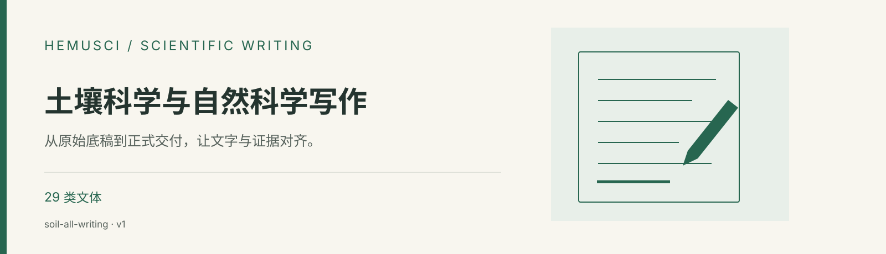

<div align="center">



# 土壤科学与自然科学写作

**从原始底稿到正式交付，让文字与证据对齐。**


[](https://github.com/SoMic520/soil-all-writing/releases/latest)

[功能介绍](#能帮你做什么) · [安装步骤](#安装步骤) · [使用示例](#使用示例) · [技能规则](skills/soil-all-writing/SKILL.md) · [下载发布包](https://github.com/SoMic520/soil-all-writing/releases/latest)

</div>

## 这是什么

把土壤科学及农业、生态、环境、地学研究中的写作规则交给 AI：先核对事实、术语和证据边界，再处理表达与文体，最后按要求交付文稿。

这是给 AI 助手使用的 **Agent Skill（技能包）**，其中包含任务规则、参考资料和辅助脚本。安装到支持技能的工具后，可以在对话中用下面的示例调用。完成任务仍需工具可用的模型及运行环境。

## 能帮你做什么

| 任务 | 具体能力 |
| --- | --- |
| **修改与翻译底稿** | 处理中英文润色、翻译与逐段审校，保留数字、单位、公式、引文、统计含义和用户锁定文本。 |
| **组织专业文体** | 按论文、基金申请、专利、标准、调查报告、技术标书、审稿回复、海报和汇报等 29 类文体处理材料。 |
| **写清图表结果** | 区分图注、结果描述、解释性分析和讨论；根据图表证据、篇幅与分析深度组织文字。 |
| **交付正式文件** | 按用户模板与官方规则处理封面、标题、字号、行距等要求，并支持 DOCX、PDF、PPTX 渲染复核。 |

## 开始前准备什么

- 原始底稿或待翻译文本
- 数据、图表、引文及必须保留的内容
- 目标文体、语言、篇幅和格式模板

按任务范围，通常可以获得：

- 修订或翻译后的文稿
- 事实、术语及图表文字核对记录
- 按任务要求生成并复核的正式文件

## 安装步骤

### 1. 准备工具

先准备 **Codex、Claude Code 或其他支持 Agent Skills 的 AI 工具**，以及 [GitHub CLI](https://cli.github.com/)。GitHub CLI 需支持 `gh skill` 命令（2.90.0 及以上；建议使用当前稳定版）。它用于下载技能。

- **Windows**：在 PowerShell 执行 `winget install --id GitHub.cli --exact`。
- **macOS**：从 [GitHub CLI 官方下载页](https://cli.github.com/) 获取安装包；已有 Homebrew 时可执行 `brew install gh`。

安装后，打开终端或 PowerShell 检查版本并登录：

```shell
gh --version
gh auth login
```

### 2. 安装到你使用的 AI 工具

以 **Codex** 为例，复制下面这一行到终端或 PowerShell 执行：

```shell
gh skill install SoMic520/soil-all-writing soil-all-writing --agent codex --scope user
```

`--scope user` 表示安装到当前用户，供不同项目使用。使用其他工具时，选择对应命令：

| AI 工具 | 安装命令 |
| --- | --- |
| Codex | `gh skill install SoMic520/soil-all-writing soil-all-writing --agent codex --scope user` |
| Claude Code | `gh skill install SoMic520/soil-all-writing soil-all-writing --agent claude-code --scope user` |
| GitHub Copilot | `gh skill install SoMic520/soil-all-writing soil-all-writing --agent github-copilot --scope user` |
| Gemini CLI | `gh skill install SoMic520/soil-all-writing soil-all-writing --agent gemini-cli --scope user` |
| Cursor | `gh skill install SoMic520/soil-all-writing soil-all-writing --agent cursor --scope user` |
| OpenCode | `gh skill install SoMic520/soil-all-writing soil-all-writing --agent opencode --scope user` |

安装前想先看看规则，可以执行：

```shell
gh skill preview SoMic520/soil-all-writing soil-all-writing
```

### 3. 在对话中使用

安装完成后，重新打开 AI 工具或开始新会话，提供你的材料，并明确写出 **“请使用 soil-all-writing……”**。从下面选一条示例，替换成你的实际任务即可。

## 使用示例

```text
请使用 soil-all-writing 逐段润色这份土壤学论文。保留所有数字、单位、引文和统计含义，先列出需要我确认的事实问题，再修改语言。
```

```text
请使用 soil-all-writing 把这份中文摘要翻译成英文。核对土壤分类与学科术语，并给出中英文逐段对照。
```

```text
请使用 soil-all-writing 根据附件图表撰写结果段。区分结果描述和讨论，先建立图表证据清单，再控制在我指定的篇幅内。
```

## 使用范围

文献元数据索引不等于已获取全文。使用全文表达材料需要相应授权；专家自然度仍需可核查的语言评价与人工复核。

## 下载与更新

- [最新发布包](https://github.com/SoMic520/soil-all-writing/releases/latest)：适合下载、留存或按平台说明手动安装。
- [当前技能 ZIP](dist/._soil-all-writing-skill-20260817-v1.zip) 与 [SHA-256 校验值](dist/SHA256SUMS.txt)：用于核对文件完整性。
- 更新已安装的技能：

```shell
gh skill update soil-all-writing
```

AI 工具与 GitHub CLI 会持续更新；命令差异请以当前工具帮助为准。`gh skill` 的安装与预览说明见 [GitHub CLI 官方文档](https://cli.github.com/manual/gh_skill)。

## 仓库结构

```text
skills/soil-all-writing/
  SKILL.md       技能入口与工作规则
  agents/        智能体配置
  references/    参考资料与任务规范
  scripts/       辅助脚本与校验工具
docs/banner.svg  仓库封面
dist/            技能发布包与 SHA-256 校验值
```

[阅读完整技能规则](skills/soil-all-writing/SKILL.md) · [查看专项参考资料](skills/soil-all-writing/references/scope-and-routing.md) · [查看拆分记录](CHANGELOG.md)

## 其他 Hemusci 技能

| 独立仓库 | 用途 |
| --- | --- |
| [R 土壤学科研绘图](https://github.com/SoMic520/r-soil-scientific-figures) | 按研究问题选图，把数据、代码与图形一起交付。 |
| [土壤学期刊投稿格式审查](https://github.com/SoMic520/soil-journal-format-review) | 依照期刊官方规则，逐项检查投稿文件。 |
| [土壤试验方法顾问](https://github.com/SoMic520/soil-methods-consultant) | 从测量对象出发，找到有出处的实验方法。 |
| [土壤三普专业报告](https://github.com/SoMic520/soil-third-survey-report) | 对齐省、市、县成果层级，整理可送审的专业报告。 |

[返回 Hemusci 技能总目录](https://github.com/SoMic520/Hemusci-Skills) · [Hemusci 网站](https://hemusci.com/skills/)

---

此仓库于 2026-10-02 从 [Hemusci-Skills](https://github.com/SoMic520/Hemusci-Skills/tree/c41529fe9fe6833ff65679133dfed24ea4d4b61c/skills/soil-all-writing) 拆分，保留该技能的提交历史、规则与资料。原集合继续保留兼容安装入口。

**使用与许可**：沿用原仓库的许可状态，目前未设置开源许可证；公开可见不等同于授予再发布许可。参考资料、标准及第三方内容的权利归其各自权利人。有关复制、修改、传播或再发布的授权，请联系仓库所有者。
